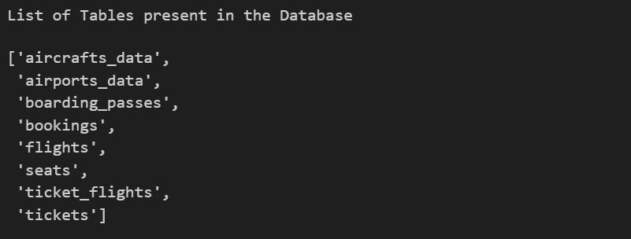
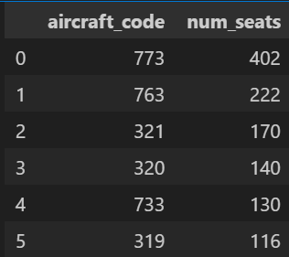
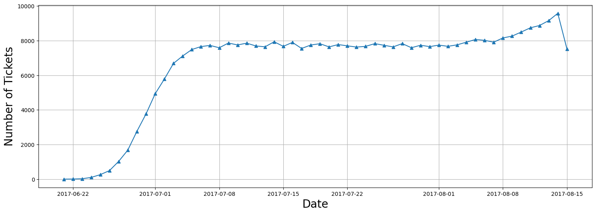
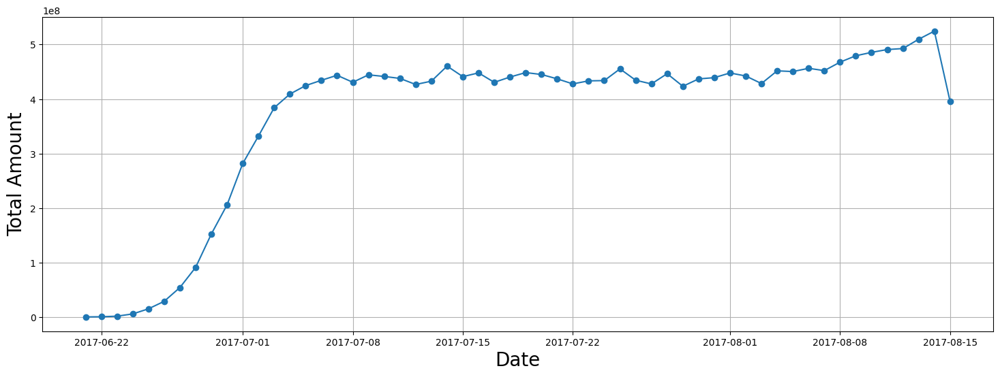
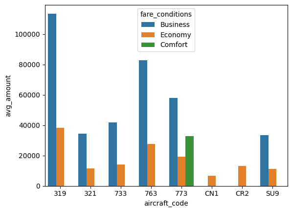
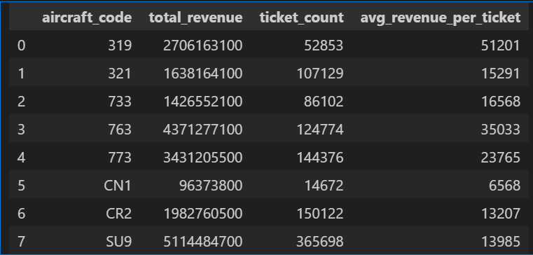
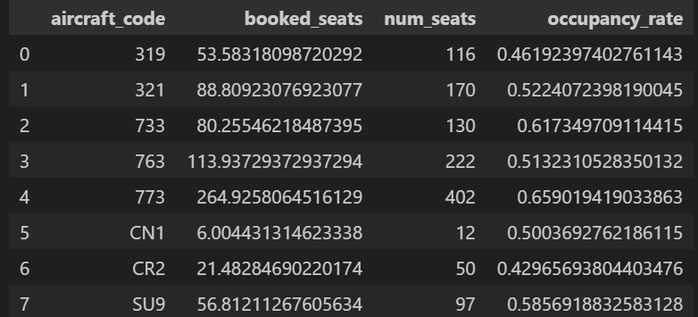
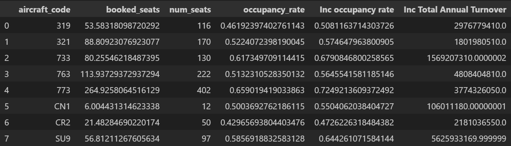

# Airline Analysis

A data-driven analysis to identify pricing and occupancy strategies that can increase airline profitability by optimizing seat utilization and fare structures.

## Executive summary

In a rapidly changing aviation landscape, our airline faced profitability challenges driven by rising operational costs, fuel prices, and stricter environmental regulations. To sustain growth and profitability, a detailed analysis was conducted to uncover opportunities to improve occupancy rates and revenue per seat.

Our findings revealed that occupancy rate directly influences profitability, with underperforming aircraft types showing untapped potential. Through strategic fare adjustments and improved capacity utilization, the airline could increase total annual revenue by up to 10%, enhancing profitability while maintaining customer satisfaction and competitive pricing.

## Background and Business Problem

Our company operates a diverse fleet of aircraft ranging from small
business jets to medium-sized machines. We have been providing
high-quality air transportation services to our clients for several years, and our primary focus is to ensure a safe, comfortable, and convenient journey for our passengers.However, we are currently facing challenges due to several factors such as stricter environmental regulations, higher flight taxes, increased interest rates, rising fuel prices, and a tight labor market resulting in increased labor costs. 
 
As a result, the company's profitability is under pressure, and they are seeking ways to address this issue. To tackle this challenge, they are looking to conduct an analysis of their database to:

- Increase occupancy rate: By increasing the occupancy rate, we can
boost the average profit earned per seat and mitigate the impact of the
challenges we're facing.
- Improve pricing strategy: We need to develop a pricing strategy that
takes into account the changing market conditions and customer preferences to attract and retain customers.
- Enhance customer experience: We need to focus on providing a seamless and convenient experience for our customers, from booking to arrival, to differentiate ourselves in a highly competitive industry and increase customer loyalty.

The end goal of this task would be to identify opportunities to increase the
occupancy rate on low-performing flights, which can ultimately lead to increased profitability for the airline.

Some of the challenges the company is experiencing include:

- Stricter environmental regulations: The demand on the airlines industry
to decrease its carbon footprint is growing, which has resulted in more
stringent environmental laws that raise operating costs and restrict
expansion potential.
- Higher flight taxes: To solve environmental issues and increase money, governments all around the world are taxiing aircraft more heavily, which raises the cost of flying and decreases demand.
- Tight labor market resulting in increased labor costs: The lack of
trained people in the aviation sector has increased labor costs and
increased turnover rates.

## Data Overview

The dataset contained detailed operational and transactional data, including:

- Aircraft codes, seat capacities, and fare categories (Economy, Business, Comfort)
- Ticket booking volumes and total revenue per aircraft
- Daily booking trends and pricing variations.

The basic analysis of data provides insights into the number of planes with
more than 100 seats, how the number of tickets booked and total amount
earned changed over time, and the average fare for each aircraft with
different fare conditions. Thesefindings will be useful in developing strategies to increase occupancy rates and optimize pricing for each aircraft. 

## Findings

### Ticket Booking and Revenue Trends

Analysis of booking data revealed a steady increase in ticket sales from June 22 to July 7, followed by a stable pattern through August, with a significant single-day peak in bookings. Revenue trends closely mirrored booking volumes, confirming a direct correlation between ticket demand and earnings.

| |  |

Business Implication:

This pattern indicates that identifying the factors driving peak booking days—such as seasonal demand, promotions, or route-specific trends—could enable the airline to replicate these conditions, thereby boosting overall revenue and optimizing flight scheduling strategies.

### Fare Structure and Pricing Comparison

The analysis of average fare costs across aircraft revealed a consistent pricing hierarchy, with business class fares priced higher than economy across all models. The comfort class, available exclusively on aircraft 773, represents the premium tier, while smaller aircraft such as CN1 and CR2 offer only economy fares.

Business implication:

This pricing pattern highlights a clear differentiation in fare structures and suggests opportunities to expand higher-margin fare classes to additional aircraft to increase overall revenue potential.

### Analyzing Occupancy Rate

Airlines must thoroughly analyze their revenue streams in order to
 maximize profitability. The overall income per year and average revenue
 per ticket for each aircraft are important metrics to consider. Airlines may
 use this information to determine which aircraft types and itineraries
 generate the most income and alter their operations appropriately. This
 research can also assist in identifying potential for pricing optimization and
 allocating resources to more profitable routes.

#### Revenue Distribution by Aircraft Type

Revenue analysis across aircraft types revealed that SU9 generated the highest total revenue, driven by lower ticket prices that attracted higher passenger volumes. In contrast, CN1 recorded the lowest revenue, likely due to its limited economy-only offering and fewer amenities.

Business Implication:

These findings indicate that affordable pricing strategies can significantly boost demand, while aircraft offering limited service classes may struggle to achieve strong revenue performance. Optimizing fare structures and improving aircraft value propositions could enhance profitability across the fleet.

#### Average Occupancy

The analysis of average occupancy per aircraft revealed varying levels of seat utilization across the fleet. Higher occupancy rates directly correlated with increased revenue and lower per-seat operational costs, while aircraft with lower occupancy experienced diminished profitability due to unfilled capacity.

Implication:

This variation indicates that pricing strategy, flight scheduling, and customer satisfaction significantly influence occupancy performance. Maintaining consistently high occupancy is essential to achieving optimal profitability and resource utilization.

#### Impact of a 10% Increase in Occupancy Rate

A simulation of a 10% increase in occupancy across all aircraft demonstrated a proportional rise in total annual revenue, confirming a strong linear relationship between seat utilization and profitability. This finding underscores that even marginal improvements in occupancy can produce significant financial gains.
The analysis also revealed that such gains can be achieved without major increases in operating costs, provided pricing strategies and route management are optimized to maintain customer demand.

Implication:

Enhancing occupancy by 10% represents a low-cost, high-impact opportunity to improve overall profitability. Rather than expanding fleet size or routes, airlines can focus on pricing optimization, targeted marketing, and operational efficiency to capture this growth potential.

## Recommendations

- Use historical booking trends and demand elasticity to adjust fares in real time. Pricing models should balance affordability with profitability, ensuring that prices remain competitive while maximizing revenue per seat.
- Expand fare class diversity—introducing premium or comfort options on high-demand routes—to attract broader customer segments and improve revenue stability across the fleet.
- Launch route-specific promotions and loyalty incentives during off-peak periods to improve seat utilization. Aim to maintain an average occupancy rate above 85% across major aircraft models.
- Reassign low-performing aircraft to shorter, high-demand routes and evaluate potential phase-out or leasing opportunities for underutilized models. Align flight schedules with periods of peak demand.
- Continue improving booking convenience, in-flight comfort, and service quality. A satisfied customer base supports sustainable occupancy growth and positive brand differentiation.

## Next Steps

Develop interactive dashboards (e.g., Power BI) to monitor load factors, revenue per available seat (RASM), and fare performance in real time. This allows proactive decision-making and continuous optimization.

## Conculsion

This analysis demonstrates that revenue optimization and occupancy management are deeply interconnected. By systematically evaluating total revenue, average ticket value, and occupancy per aircraft, airlines can identify the most effective levers for improving profitability.

A 10% increase in occupancy rate has the potential to yield a comparable increase in annual revenue—without expanding fleet size or routes. This underscores the power of pricing efficiency, route optimization, and demand forecasting in driving financial performance.

However, profitability should not come at the expense of passenger satisfaction or safety. The airline must maintain a balanced approach that combines competitive pricing with consistent service quality.

By adopting a data-driven, customer-centered strategy, the airline can achieve sustainable profitability, operational excellence, and long-term resilience in a highly competitive market.
